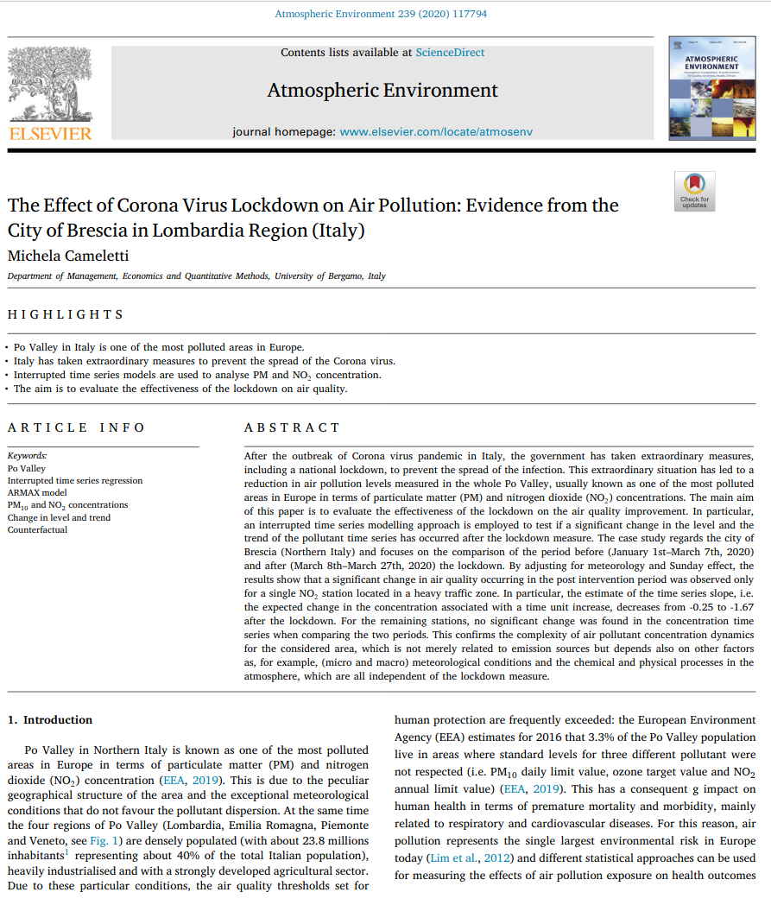
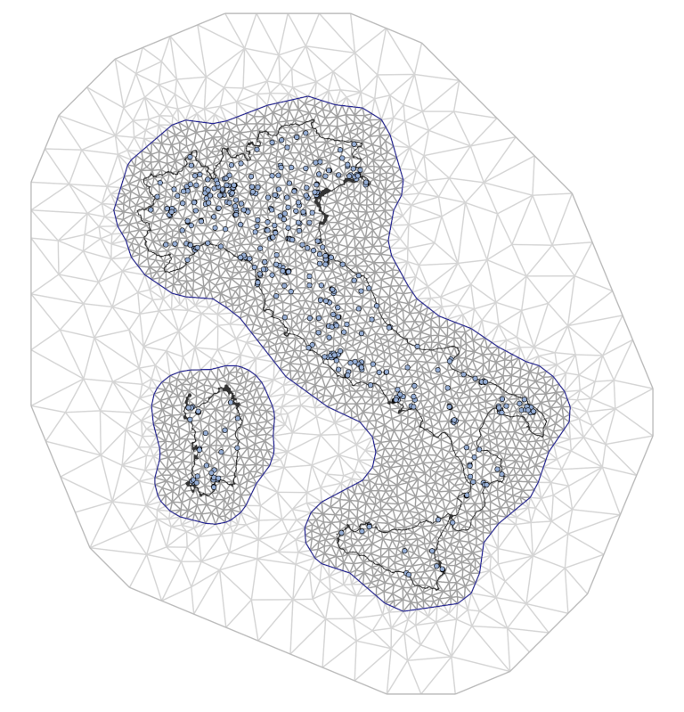

name: inla
layout: true
class: middle, center
---
# Obiettivo 

Analisi  delle  serie  di  dati  di  concentrazione  di   `\(PM_{10}\)`,  `\(PM_{2.5}\)`,  `\(NO_{2}\)`, `\(O_{3}\)`

---

layout: false
class: center

### [The effect of Corona Virus Lockdown on Air Pollution: Evidence from the City of Brescia in Lombardia Region (Italy)](https://www.sciencedirect.com/science/article/pii/S1352231020305288)

---

### Interrupted time series regression

#### Periodo di studio 

- 1 Gennaio - 27 Marzo 2020

#### Stazioni

- Brescia:
  - `\(NO_2\)`: 3 stazioni
  - `\(PM_{10}\)`: 2 stazioni
  
#### Formula:
  
`$$ y_{t}=\alpha_{0}+\alpha_{1}T+\alpha_{2} \mathbb 1^L_{t}+\alpha_{3}(T \mathbb 1^L_{t})+X_{t} \beta+\eta_{t}$$`

`$$ \eta_{t}=\phi_{1}\eta_{t-1}+\ldots+\phi_{p}\eta_{t-p}+\epsilon_{t}+\theta_{1}\epsilon_{t-1}+\ldots+\theta_{q}\epsilon_{t-q}$$`

Regreggion error term `\(𝜂_{𝑡}\)`: processo ARMA con coefficienti `\(\phi_{1}\)`,`\(\ldots\)`,`\(\phi_{𝑝}\)`,`\(\theta_{1}\)`,`\(\ldots\)`,`\(\theta_{q}\)`  

`$$\epsilon_{𝑡} \sim \mathcal{N}(0,\,\sigma^{2})$$`

---

class: middle, center

### [Tobler’s First Law of Geography](https://en.wikipedia.org/wiki/Tobler%27s_first_law_of_geography)

---

class: center

### INLA & SPDE

- INLA: Integrated Nested Laplace Approximation
- Stochastic Partial Differential Equation 

Pacchetto software: `\(\tt r-inla\)`

#### Special guests

Sara Martino: Norwegian University of Science and Technology, Trondheim, Norway
Michela Cameletti: University of Bergamo,  Bergamo, Italy
 

